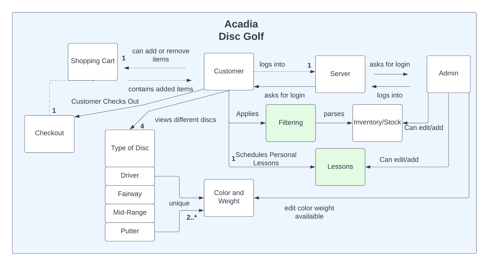
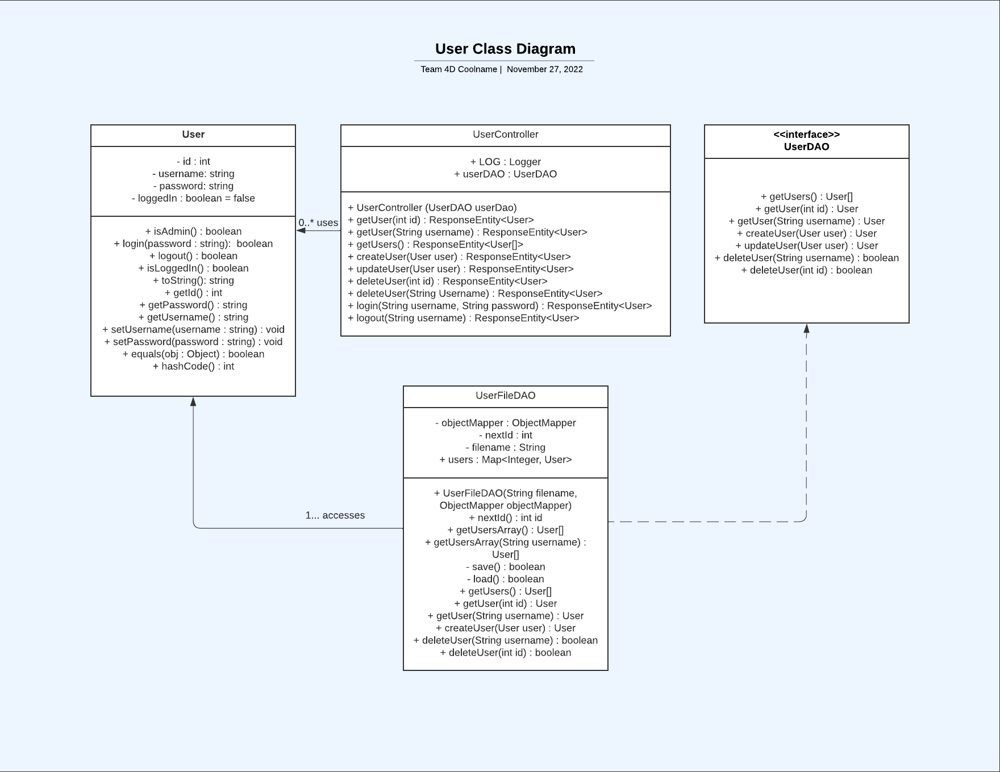
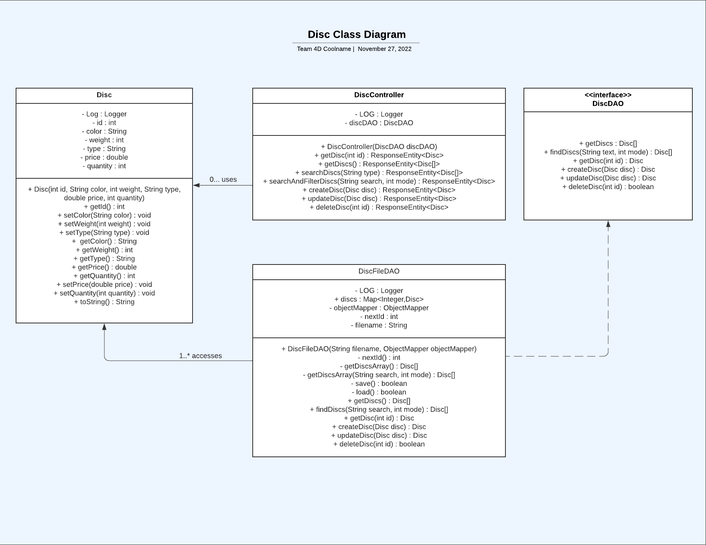
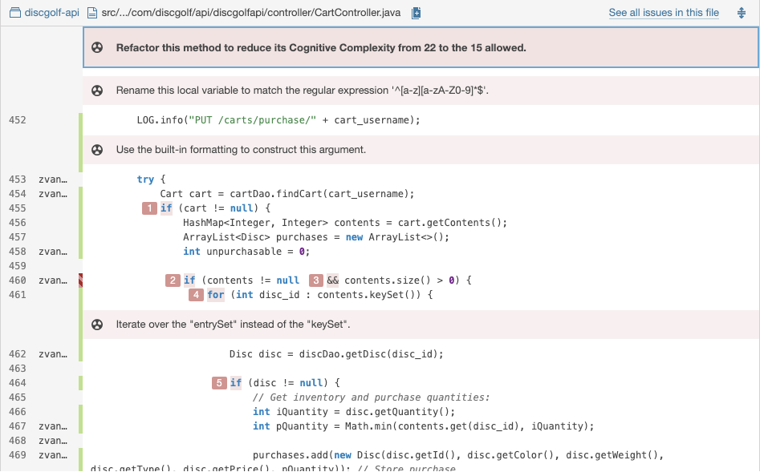
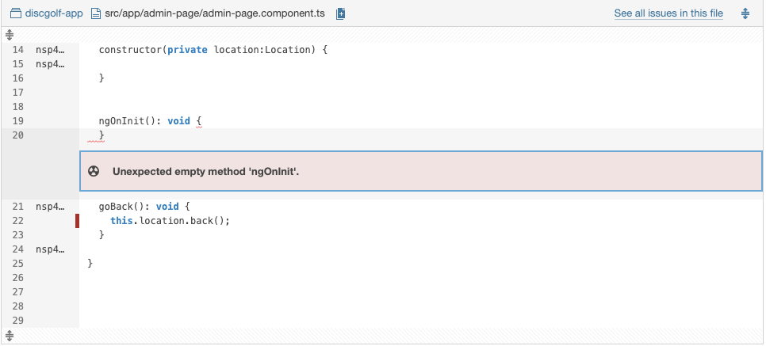

# Acadia Disc Golf Design Documentation

## Team Information
* Team name: 4D Cool-Name
* Team members:
  * Robert Falso
  * Bibhash Thapa
  * Aiden Sciamatore
  * Zachary James Van Horn
  * Nikhil Patil

## Executive Summary
The product is an online Disc Golf store where customers can purchase different types of discs. They have the ability to search for their desired discs, and once they find them, they can customize the color and weight of it to meet their likings. If the store is out of stock for a certain color or weight, the Owner has the ability to update the website so the customer is aware of both the available and unavailable customization options. Once a disc is customized to the customer's liking, they can add it to their shopping cart and checkout. Upon checkout, they have the option of scheduling a coaching session with an experienced disc golf coach. If the customer is not interested, then they can enter their payment information and complete their purchase.

### Purpose
<!-- > _Provide a very brief statement about the project and the most
> important user group and user goals._ -->
This is an E-Store Project for a fictional disc-golf store located in Maine.
The customer & admin group is the most important user group to this website, as the
customers are the driving force behind the business. The goals for the user are to
ultimately purchase discs & lessons in order to learn how to play disc golf. 

### Glossary and Acronyms
| Term | Definition |
|------|------------|
| SPA | Single Page |
| MVP |  Minimal Viable Product |
| Driver |  The type of disc; i.e. think clubs in golf |
| DAO | Data Access Object |
| API | Application Programming  Interface - methods to integrate an application |
| UML | Unified Modeling Language  - Used to model code and programs |
| Angular| The framework used to create the website |
|MVVM| Model-View-ViewModel - pattern used to separate the UI and logic| 

## Requirements
* Java: 11
* Apache Maven: 3.8.6
* Angular: 14.2.7
* Angular CLI: 14.2.6
* Node: 16.18.0
* Package Manager: npm 8.19.2
* Spring Boot: 2.5.6

<!-- This section describes the features of the application. -->
<!-- > _In this section you do not need to be exhaustive and list every
> story.  Focus on top-level features from the Vision document and
> maybe Epics and critical Stories._ -->
### Features:

### Inventory Management
Allows the admin/owner to use inventory management features to add/remove/edit accessories being sold as well as customization options. 

### Shopping Cart 
Allows the cuustomer to use shopping cart features so that to add, remove, and set the quantities of discs in the cart.

### Login/Sign in
Allows both customer and admin to create a new account through sign in or log in to access their respective privileges. 

### Enhanced Browsing
Allows both customer and admin to browse through the discs through the search and filter options. 

### Data Persistence
Allows both customer and admin to have their data persisted in case they logout or close the website and visit back again later.

### Definition of MVP
<!-- > _Provide a simple description of the Minimum Viable Product. _ -->
Our Minimal Viable Product consisted of:
 * 	Home Page: the initial landing page
 * 	Admin Page: the page where admin can edit inventory
 * 	Products Page: where the products that are being sold
 * 	Login/Signup: Minimal Authentication
 * 	Shopping Cart: For Customers to hold their products
 * 	Inventory for admin: So an admin can update the stock
 This came out to to be a fully functioning website at the end of Sprint 2. Albeit with some bugs.

### MVP Features
<!-- > _Provide a list of top-level Epics and/or Stories of the MVP._ -->
 * Inventory Management
   * Create new product
   * Delete a single product
   * Get a single product
   * View list of accessories
   * Get entire inventory
   * Search for product
   * Update a product
 * Shopping Cart
   * Add disc to cart
   * Remove disc from cart
   * Change disc quantity
   * Proceed to chekout
 * Minimal Authentication/Persistence
   * Login/Logout as user
   * Login/Logout as admin
 * Disc Customization
   * Create accessory
   * Update inventory

	
 

### Roadmap of Enhancements (10% feature)
 * Adding Lessons & The Ability to Purchase them 
 * Filtered Search for the Discs 
#### As of 11-14-2022
The enhancements detailed above have been implemented. There are still some bugs and further enhancements to be made to the the features-- although that is to be reserved for Sprint 4
#### As of 11-26-2022
All further enhancements and bugs have been fixed during Sprint 4.
 
* Lessons
   * Schedule Personal One on One Lessons
   * View Lessons
       * All 
       * User Specific
    * Create Lessons
    * Delete Lessons
* Filtered Search
   * Can filter by type
      * Price
      * Color
      * Type
      * Weight

## Application Domain

Customers can browse the website to find their desired disc. They have the ability to customize it before they purchase it. The Owner can manage the available inventory so that the website does not promote products that are out of stock.

The Customer can view different types of discs including: Distance Driver, Fairway Driver, Mid-Range, and Putter. Each disc has a customizable color and weight. Once the customer is satisfied, they can add discs to their shopping cart and checkout. The customer has the ability to sign up or login so that they can save the items in their cart. Before checking out, customers will have the ability to schedule an appointment with an experienced disc golf coach if they are looking to improve their skills. If not, they can just enter their payment information and complete their purchase. 

When the Owner logs into the website, they can manage the inventory by editing the available customization options.

## Architecture and Design
The following diagrams provide visual aids for the software architecture & design

#### Disc Sequence Diagram

- The disc sequence diagram displays the sequence behind how a user would purchase discs
- It also shows how an admin would interact with discs
#### Lessons Sequence Diagram

- The lesson sequence diagram displays how a user would go about scheduling lessons
- Also shows how an admin would interact with lessons

#### User Class Diagram

This is the user class diagram
- It shows the relationship between the Controller, DAO, and the Model for the object and how they interact with one another
- Also show cases all of the methods and variables for each object
#### Cart Class Diagram

This is the cart class diagram
- It shows the relationship between the Controller, DAO, and the Model for the object and how they interact with one another
- Also show cases all of the methods and variables for each object
#### Lesson Class Diagram

This is the lesson class diagram
- It shows the relationship between the Controller, DAO, and the Model for the object and how they interact with one another
- Also show cases all of the methods and variables for each object
#### Disc Class Diagram

This is the dsic class diagram
- It shows the relationship between the Controller, DAO, and the Model for the object and how they interact with one another
- Also show cases all of the methods and variables for each object
### Summary

The following Tiers/Layers model shows a high-level view of the webapp's architecture.

The e-store web application, is built using the Model–View–ViewModel (MVVM) architecture pattern. 

The Model stores the application data objects including any functionality to provide persistance. 

The View is the client-side SPA built with Angular utilizing HTML, CSS and TypeScript. The ViewModel provides RESTful APIs to the client (View) as well as any logic required to manipulate the data objects from the Model.

Both the ViewModel and Model are built using Java and Spring Framework. Details of the components within these tiers are supplied below.

### Overview of User Interface

<!-- This section describes the web interface flow; this is how the user views and interacts
with the e-store application. -->

The user is first presented with the homepage where they have a variety 
of options from a navigation bar. They they can login/sign up, view
lessons, and view products. They cannot, however, add these to cart,
as they need to be a registered user. The color palette used for the
website pairs nicely and is not too overbearingly bright for a user,
while also using colors that are pleasing to the eye for customer
retention. There is also now a lessons page where customers can look at
lessons and search lessons by date. 

### View Tier
<!-- > _Provide a summary of the View Tier UI of your architecture.
> Describe the types of components in the tier and describe their
> responsibilities.  This should be a narrative description, i.e. it has
> a flow or "story line" that the reader can follow._ -->
The User starts off with the home screen, where they are prompted to 
to log in to start purchasing discs and lessons. Admins can also log in and
create/edit products & lessons. Once a user lands on the products
page, they can add them to their cart. If they want to get a lesson on how to use
said disc, they can subscribe to a lesson on the lessons page. Once they schedule themselves for a lesson, it will populate on their "Schedule Page".

The View consists of the angular frontend: components and HTML NG tags. The following enable user login: loginComp. The following enable user interaction with
products: productComp, productDetailComp, cartComp, and inventoryComp. Finally, the following enable user interaction with lessons: lessonComp, viewLessonsComp,
and scheduleComp. The aforementioned components govern user interaction with the elements of our site and call services accordingly to mutate and retreive
elements from the backend.

### ViewModel Tier
<!-- > _Provide a summary of this tier of your architecture. This
> section will follow the same instructions that are given for the View
> Tier above._

> _At appropriate places as part of this narrative provide one or more
> static models (UML class diagrams) with some details such as critical attributes and methods._ -->
The ViewModel consists of our frontend services and backend controllers. Together, services call controller API methods,
sending data between the view and the model (the business logic), in order to process user/admin changes on the site and
in the database. The following services are used by the View to update the backend product database and relay inventory
and cart changes to the frontend: productService, shoppingCartService. Users are also able to interact with our
10% feature (individual coaching lessons), thus the following services enable the View to update the backend lesson database
and relay inventory and schedule changes: lessonService. The previous services and site depend on users; as such,
the following manages changes in user state on the front and backend: loginService. As for the controllers which each service
calls to handle backend persistence and logic updates: discController and cartController (products), lessonController (lessons),
userController (user state).

### Model Tier
<!-- > _Provide a summary of this tier of your architecture. This
> section will follow the same instructions that are given for the View
> Tier above._
> _At appropriate places as part of this narrative provide one or more
> static models (UML class diagrams) with some details such as critical attributes and methods._ -->
The Model consists of our backend POJOs which hold the data that is used and mutated in the backend controllers,
and finally displayed on the frontend UI. The following manage product data: Disc, Cart. Disc objects are our
general product and are stored in the container class Cart. Both are serialized into their own JSON datafiles:
inventory (Discs), carts (Cart(Discs)). The following manage lesson data: Lessons. Lessons is similar to the Cart
class, where it stores a list of product (lessons) as well as a username for who is subscribed. It alone is
serialized in the following datafile: lessons (Lessons). Finally the User object stores user information. It is serialized in the following
datafile: user (User).

## Static Code Analysis
<!-- > _Discuss design improvements that you would make if the project were
> to continue. These improvement should be based on your direct
> analysis of where there are problems in the code base which could be
> addressed with design changes, and describe those suggested design -->
For all tiers: Model, View, and Persistence, we were able to thoroughly implement and successfully pass all our tests and ensure a good code coverage score in the static code analysis that we conducted through SonarQube and Jacoco.

### SonarQube Report
As seen below, we were able to guarantee a 93.3% code coverage score on comprehensive backend work in disc-gold-api. Through thorough unit testing 
and making use of mock objects through mockito we were able to meet the required threshold that we had set of >92% for our SonarQube reports. In addition, we were also able to acheive 0 bugs and 0 vulnerabilities in our code which speaks to the effective testing that has been done throughout
the project.

### Jacoco Report

Our Jacoco report also indicated an impressive overall code coverage score of 96% across all three tiers as seen below. We managed to accomplish 94% code coverage in our Persistence tier, 95% in Model, and 98% in the Controller tier. We met our set threshold of ensuring atleast 90% in each tier and over 95% overall. 

## Quality of Design
### Coarse-grained Design Principles
#### "Low" Coupling
We made great efforts to maintain a single-responsibility API with an expanded MVVM software architecture splitting the Model tier into a model, controller, and persistence layer. The controller layer supplements the backend API acting as a top-level business-logic class utilizing the segregated functions of the model and persistence layers. The model layer is strictly purposed for data de/serialization and has no dependencies on either the controller or persistence layers. The persistence layer streams all data in the form of model objects and manages CRUD operations with low-level dependencies on its specific model type. All model types (User, Cart, Disc, and Lesson) utilize this architecture to remove unnecessary relationships and maintain a consistent three-class open-closed unit that abides by the Law of Demeter. The front end likewise supports this three-class unit architecture with component, service, and object definition layers.

#### High Cohesion
Each layer within the Model and View-Model tier is designed with pure fabrication in mind. The backend model, controller, and persistence layers are segregated by model types (User, Cart, Disc, and Lesson) and serve as cookie-cutter units to decouple unrelated data while standardizing pure data streaming. As previously mentioned, the front end likewise supports this three-class unit architecture with component, service, and object definition layers. This architecture remains open-closed to future-proof cohesion-enhancing additions despite enforcing a highly cohesive standard for each front/backend definition/POJO and associated service/API.

#### Low Complexity
As mentioned above, the expanded MVVM architecture permits a cookie-cutter unit for each model type, significantly reducing the complexity of adding new data and behavior. This redundancy was evidently functional by the relatively short development time when implementing our 10 percent feature (i.e., Lessons). Unit testing with mocks was similarly simple as a result.

#### Proper Encapsulation
All the backend classes implement model-specific interfaces, and although they have no unit scope overlap, each implements interchangeable API endpoints. Moreover, both the front and back end encapsulate each architecture layer using components and classes. Thus, the attributes are component/class specific and rely on method or function calls to stream data. This proper encapsulation with top-level interfaces allows any piece of the architecture to be updated without affecting its dependencies. Significant efforts have been made to ensure behaviors are not relied on between class and component dependencies, making updates and open-closed additions seamless.

### Fine-grained Design Principles
#### Option Operand Principle
In all classes and components, we constrained the arguments of a routine in design only to include operands (i.e., no options). The singular exception we are working on redesigning is the Disc persistence layer’s filter search which violates the first of the two following contexts: a default value is given in the absence of an argument when called by a client; a passed argument is treated as an option. Maintaining this design principle is essential, as it decouples and closes methods to editing by adequately placing the responsibility of implementing a backdoor to bad paths on the generating routine. Thus, after resolving the exception above, our code will thoroughly segregate responsibility among its tiers and layers.
 
## Future Refactoring and Design Improvements
### Refactoring
#### Pure Fabrication
 * Controller and DAO interfaces should be collected into one top-level pair for all model-specific units to implement.
 * The NoSQL data persistence files should be merged into a singular SQL or Mongo-esque database to prevent further redundancy.
 * The shopping cart controller should accept all data types in inventory (i.e., User, Disc, Lesson).

#### Asynchronous Rendering
 * All static values in service components should be asynchronous promises with appropriate getter and setter functions.
 * Rerendering should be delegated solely to Angular, and all forms of page refreshing should be removed.

#### Option Operand Principle
 * The Disc persistence layer’s filter search should not provide a default value for the filter mode.

### Design Improvements
#### User Interface
 * All components should give feedback when used.
 * Loading indicators should be implemented to give the user a sense of state.
 * Placeholder images should supplement broken icons and elements.
 * The home page should be upgraded to include a spinner or element of interest.

#### Front end
 * All components should inherit a top-level cascading style sheet.
 * We should integrate a library for high-level UI components.
 * All service components should use asynchronous promises with appropriate getter and setter functions.
 * The abuse of lambdas should be mitigated with proper data streams.

#### Backend
 * All backend APIs should follow a conventional style and transfer data via the body of HTTP requests (i.e., the use of URL parameters should be limited).
 * Error response should contain additional information for the front end to use in diagnostics.

### Analysis Defined Areas of Improvement

#### Defining a Constant Instead of Duplicating Literal

Duplicated string literals make the process of refactoring error-prone, since one must be sure to update all occurrences. On the other hand, constants can be referenced from many places, but only need to be updated in a single place. So for debugging and code readability purposes we could define a string for the url that has been used multiple times throughout program.

 

#### Reduce Cognitive Complexity

Cognitive Complexity is a measure of how hard the control flow of a method is to understand. Methods with high Cognitive Complexity will be difficult to maintain. Therefore, we could reduce the complexity of this method by combining multiple 'if' statements, seperating the different 'if' blocks, or make use of helper functions.

 

#### Define Methods As Static

Correctly updating a static field from a non-static method is tricky to get right and could lead to bugs if there are multiple class instances. Ideally, static fields are only updated from synchronized static methods. Since the load() function is being used by multiple class instances and it is not defined as a static method, it may lead to issues. So an easy improvement could be to define such methods as static methods.

 

#### Removing Empty Methods

Another area of improvement in our code could be to remove methods with empty bodies. In our case, we had a lot of flags from SonarQube saying we had 
empty 'ngOnIt' methods in our TypeScript files. We could fix this by either throwing an exception, adding a nested comment explaining the omission, or removing the method completely to prevent unexpected behavior in production.

 

## Testing
<!-- > This section will provide information about the testing performed
> and the results of the testing. -->
Testing wise, our group had a nice overall jacoco score of 87% at the end of the third sprint. For sprint 4, we hope to get a higher code coverage to ensure that our code is high quality. 

### Acceptance Testing
<!-- > _Report on the number of user stories that have passed all their
> acceptance criteria tests, the number that have some acceptance
> criteria tests failing, and the number of user stories that
> have not had any testing yet. Highlight the issues found during
> acceptance testing and if there are any concerns._ -->
Our team was successful in meeting the required acceptance criteria for all the stories present in the sprint backlog. For sprint 3, we had seven user stories in our sprint backlog of which all the acceptance criteria associated which each story passed. The same can be said for the eleven stories that were present in our in sprint 2 spring backlog. For sprint 4, we have ~twelve user stories that have not been tested yet. These stories involve refactoring, testing, retrospective, etc. We plan on passing the acceptance criteria tests for each story by the end of the current sprint (sprint 4).

### Unit Testing and Code Coverage
<!-- > _Discuss your unit testing strategy. Report on the code coverage
> achieved from unit testing of the code base. Discuss the team's
> coverage targets, why you selected those values, and how well your
> code coverage met your targets. If there are any anomalies, discuss
> those._ -->
Our goal for code coverage was to reach a goal of 90% across all platforms. This goal
ensures that all major testing is covered (leaving only small gaps).
Our unit testing strategy was to require testing before the code review despite the cost
if the review required a rewrite of functionality. Requiring tests allowed us to cover more
code as our baseline. We also rely on Jacoco and SonarQube to report any missing tests or
lack of breadth. We have logged all of these reports in a checklist and have saved them for
Sprint 4's bug fixing, testing, clean up, and documentation phase.
